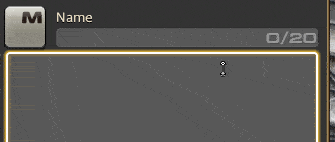
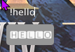

# Symbol Picker

Testing repo : https://plogon.xorus.dev/

Or grab a build from the GitHub actions (if they work).

### To-do list before submitting to testing repo

This plugin is in line with Dalamud plugin rules and will be submitted to the testing repository when these items are done :

- [ ] Find a way to paste / insert character into the game:
  1. In-game textbox
  2. ImGui textbox
  3. If nothing is focused, copy to clipboard
- [ ] Copy notification / feedback UI
- [ ] Fix UI as described in todo section

## Usage

- `control`+`.` opens the quick character picker.
    1. type in the name of the character you want to use
    2. press enter to copy to clipboard
    3. `control`-`v` into the text-box you were typing
- `/pcharmap` opens the character list.

### Character buttons

- Left click copies it to the clipboard
- Right click adds it to the quick palette / favourites.

### Convert to boxed

Prefixing text in the quick box by `!` will convert the letters to boxed style :

## why

I once did `win`+`.` and it opened an emoji picker on Windows, and I was like WOAAA so I made it so I could go WOAAA in
FFXIV too.

Also finding characters for macros SUCKS.

## broken things

- Only works with the AXIS font.
- The quick search box does not take focus the first time you open it.
- unproper unload causes crashes?
- it's a proof of concept

## todo

- the search input is not focused the first time you open it
- left/right to navigate in search results (actually implemented but broken :( )
- fix favourite not saving properly
- auto-paste on click/enter
- customize open shortcut
- open main UI button in mini-search
- ordering for favourites (drag and drop?)
- better UI
- build characters file in CI

## build

It's a bit of a mess, but I didn't want to include a 7mb lib in the build just for unicode character descriptions... If
you want to change the supported 'standard' characters, you need to build and run the `BuildChars` project, as it will
generate the `characters.json` data file that will then be embeded into the main project.

I don't have enough msbuild knowledge to do this "the right way" so there it is.
